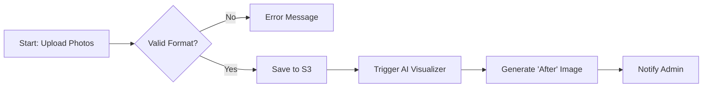
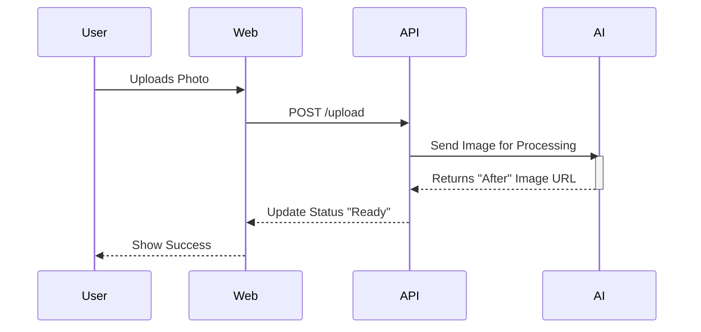
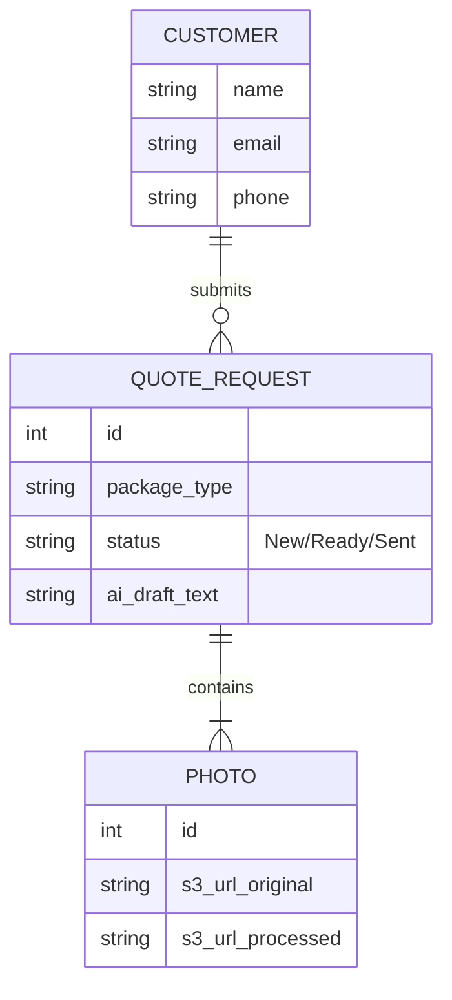

# Diagram Options for YardGuard Architecture

Since image generation is currently unavailable, we can use **Mermaid** code to create distinct, professional technical diagrams. Here are the three most useful types for this project:

## 1. Flowchart (Great for Process Logic)
*Best for showing the step-by-step user journey and system decisions.*

## 2. Sequence Diagram (Great for API/Data Flow)
*Best for showing how the Frontend, Backend, AI, and Database talk to each other over time.*

## 3. Entity Relationship (ER) Diagram (Great for Database)
*Best for defining exactly what data fields we are storing.*

